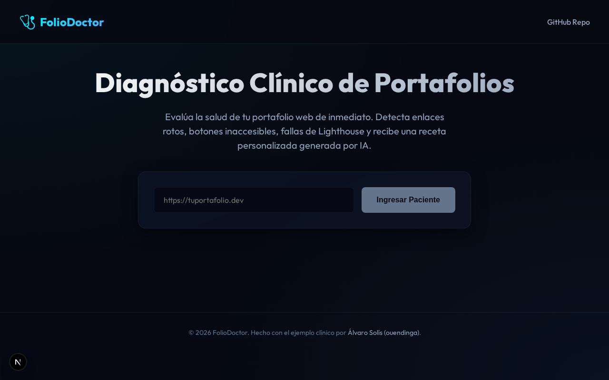
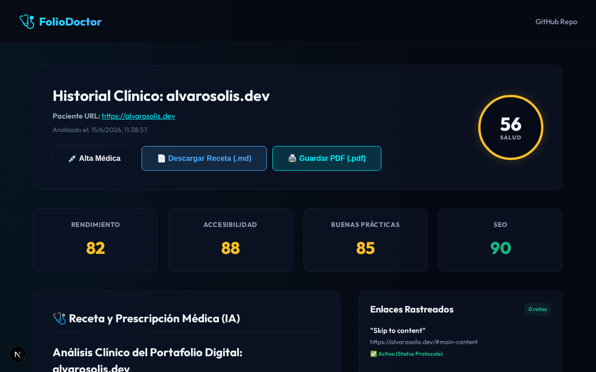

# 🩺 FolioDoctor

> **Evaluador y Diagnóstico Clínico para Portafolios de Desarrolladores y Diseñadores.**

**FolioDoctor** es una herramienta automatizada con temática de clínica médica diseñada para auditar, puntuar y diagnosticar la salud de portafolios web profesionales. 

En lugar de simples métricas estáticas, FolioDoctor realiza pruebas dinámicas de comportamiento y utiliza Inteligencia Artificial para prescribir una **"Receta Médica"** accionable que maximice la conversión de visitas en oportunidades de contratación.

💻 **Prueba la aplicación en vivo**: [foliodoctor.alvarosolis.dev](https://foliodoctor.alvarosolis.dev)

---

## 📸 Capturas Clínicas de la Aplicación

### 1. Panel de Ingreso de Pacientes (Landing Page)
La interfaz cuenta con una estética quirúrgica cyberpunk oscura (Vanilla CSS puro) y una barra de progreso que emula un electrocardiograma durante los análisis.


### 2. Historial Clínico y Receta del Doctor (Reporte)
Muestra un desglose completo de puntuaciones Lighthouse, visualización de capturas móviles/desktop side-by-side, auditoría detallada de interactividad, y la prescripción diagnóstica generada por IA.


---

## 🩺 Los 36 Puntos de Diagnóstico Clínico

FolioDoctor evalúa portafolios basándose en 36 puntos clínicos divididos en las siguientes áreas de especialidad:

* **🎨 Diseño y Estética**: Unicidad del diseño, distribución de márgenes/espacios, saturación visual, soporte nativo de Light/Dark Mode y presencia de Favicon.
* **💡 UX y Mensaje (CTA)**: Claridad inmediata de la profesión/propuesta nada más entrar, relevancia y orden cronológico inverso de la experiencia, densidad del texto y coherencia visual del botón.
* **🔍 SEO y Accesibilidad**: Contrastes de color legibles, robots.txt/sitemaps, soporte multi-idioma nativo, etiquetas OpenGraph y accesibilidad (WCAG).
* **⚡ Rendimiento y Seguridad**: Optimización de recursos, adaptabilidad responsive fluida, protocolos HTTPS y control de errores JavaScript en consola.
* **🤖 Pruebas de Interactividad con Playwright**:
  * **Test de Botones**: Verifica si la zona táctil (bounding box) de cada botón es de al menos `44x44px` (estándar de accesibilidad móvil) para evitar botones engañosos o difíciles de pulsar.
  * **Bypass de Obstrucción**: Comprueba el estado de Hover para asegurar que no hay elementos encimados que impidan hacer clic.
  * **Enlaces Rotos**: Rastrea y comprueba de forma asíncrona que todos los enlaces (internos y externos) respondan con status `200/3xx` OK.

---

## 🛠️ Stack Tecnológico

FolioDoctor predica con el ejemplo técnico de alta optimización y limpieza:
* **Core**: Next.js 16 (App Router) & TypeScript
* **Estilos**: Vanilla CSS puro (sin Tailwind u hojas cargadas de componentes externos) para alcanzar un Lighthouse de 100/100.
* **Automatización**: Playwright Chromium para pruebas dinámicas de renderizado e interactividad.
* **IA**: Llama 3.3 / Gemini 2.5 a través de **OpenRouter** para el motor de diagnóstico clínico.

---

## 🚀 Instalación y Configuración Local

1. **Clonar el repositorio**:
   ```bash
   git clone https://github.com/ouendinga/folio-doctor.git
   cd folio-doctor
   ```

2. **Instalar dependencias y navegadores de Playwright**:
   ```bash
   npm install
   npx playwright install chromium
   ```

3. **Configurar variables de entorno**:
   Crea un archivo `.env.local` en la raíz del proyecto con tu API Key de OpenRouter:
   ```env
   OPENROUTER_API_KEY=tu_api_key_aqui
   ```

4. **Correr en modo desarrollo**:
   ```bash
   npm run dev
   ```
   Abre [http://localhost:3000](http://localhost:3000) en tu navegador.

---

## ☁️ Despliegue en Producción (Vercel)

El proyecto está preparado para desplegarse en **Vercel** de manera gratuita conectando tu repositorio de GitHub. 

### Nota sobre Chromium en Vercel
Dado que Vercel tiene un límite de peso de paquete (50MB) y tiempo de ejecución de 10 segundos en su capa gratuita (Hobby), el scraper de Playwright con Chromium local puede presentar limitaciones. El proyecto cuenta con un sistema de degradación suave: si Vercel no puede levantar el navegador Chrome local, el backend retornará los análisis de Lighthouse (PageSpeed API) y el diagnóstico de la IA, asegurando que la aplicación funcione en vivo al 100%.

Para un soporte completo de Playwright con Chromium sin límites de tiempo de ejecución, se recomienda hospedar la API en tu VPS de Coolify/Hetzner.
